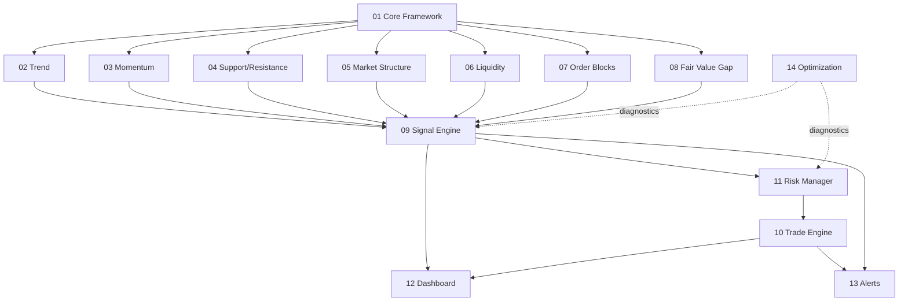

# Architecture

System design for XAU AI Institutional Scalper Pro. This document describes
*how* the pieces fit together. It complements [SPECIFICATION.md](SPECIFICATION.md)
(*what*) and [ROADMAP.md](ROADMAP.md) (*when*).

- **Status:** Draft (framework phase, `v0.0.1`)
- **Compilation unit:** `../src/MASTER_STRATEGY.pine` (the only compiled file).

---

## 1. High-level design

The strategy is a **single Pine v6 file** organized into cooperating modules.
Analytical modules produce structured observations; the Signal Engine fuses them
into a deterministic score; the Trade Engine and Risk Manager turn approved
signals into orders; Dashboard and Alerts surface state. Optimization provides
diagnostics.

> Module code all lives in `MASTER_STRATEGY.pine`. The `src/modules/` tree holds
> **documentation only** (see [ADR-0005](DECISIONS.md)).

## 2. Layered view

```
+-----------------------------------------------------------+
|  Presentation      12 Dashboard        13 Alerts          |
+-----------------------------------------------------------+
|  Execution         10 Trade Engine     11 Risk Manager    |
+-----------------------------------------------------------+
|  Decision          09 Signal Engine (deterministic score) |
+-----------------------------------------------------------+
|  Analysis   02 Trend   03 Momentum  04 S/R   05 Structure |
|             06 Liquidity  07 Order Blocks  08 Fair Value  |
+-----------------------------------------------------------+
|  Foundation        01 Core Framework                      |
+-----------------------------------------------------------+
|  Cross-cutting     14 Optimization (diagnostics)          |
+-----------------------------------------------------------+
```

## 3. Data flow

```
Market data (XAUUSD, M1/M5)
        |
        v
[01 Core Framework] --- config, shared state, session context
        |
        v
[Analysis modules 02..08] --- each emits structured, explainable observations
        |
        v
[09 Signal Engine] --- deterministic weighted fusion -> score + rationale
        |
        v
[11 Risk Manager] --- validate exposure, size position, define stops
        |
        v
[10 Trade Engine] --- place/modify/close orders on confirmed bars
        |
        +--> [12 Dashboard] renders state & score breakdown
        +--> [13 Alerts]    routes alert conditions
```

All evaluation is on **confirmed** bars; higher-timeframe reads use
`request.security(..., lookahead = barmerge.lookahead_off)` to prevent
repainting.

## 4. Module relationships



## 5. Dependency graph (textual)

```
01 Core Framework      -> (none)  foundation for all
02..08 Analysis        -> 01
09 Signal Engine       -> 02, 03, 04, 05, 06, 07, 08
11 Risk Manager        -> 09, 01
10 Trade Engine        -> 11, 09, 01
12 Dashboard           -> 09, 10, 01
13 Alerts              -> 09, 10, 01
14 Optimization        -> reads 09/11 diagnostics (no runtime coupling into trades)
```

Dependencies flow **upward only** (foundation → analysis → decision → execution →
presentation). No cycles are permitted. The authoritative, per-module dependency
contract (data owned/consumed/prohibited, callers, forbidden dependencies) is
[MODULE_OWNERSHIP.md](MODULE_OWNERSHIP.md).

**Module 02 (Trend Engine) is complete and permanently frozen at `v0.2.0`**
([ADR-0016](DECISIONS.md)). It depends **only on Core (Module 01)** — verified: every input is a
Core primitive (`BarContext`, `Config`, `ctxHtfValue`, `util*`) or market data — so no cycle is
possible. Downstream modules (03–14) consume it **read-only** through the frozen `trend*`
accessors over the per-bar `TrendState`; the eight-function public API is sufficient for all of
them (future needs are limited to additive convenience accessors — see [API.md](API.md)).

## 6. Core Framework internal architecture

Module 01 occupies the Foundation layer and is itself organized into subsystems, in
strict dependency order (leaf → composite). Full detail:
[../src/modules/01-core-framework/README.md](../src/modules/01-core-framework/README.md).

```
util  (pure helpers)
  -> log  (diagnostics primitive)
       -> err  (uses log)
            -> cfg  (uses util, err, log)   config -> validate -> immutable Config
                 -> ctx  (uses util, cfg)    per-bar context, non-repainting primitives
                      -> state  (uses cfg, ctx)   single KernelState (var)
                           -> core orchestrator   coreInit / coreOnBar (module seam)
```

Internal data flow:

```
input.* -> cfgBuild (validate) -> immutable Config -> stateInit (cache)
per bar -> coreOnBar -> ctxBuild -> BarContext -> stateUpdate -> modules 02..14
diagnostics -> bounded ring buffer -> logDrain -> Dashboard (12) / Optimization (14)
```

Key invariants: one persistent object (`KernelState`); modules never read `input.*`
directly; all HTF access flows through `ctxHtfValue` (`lookahead_off`, confirmed).
Canonical file **section ordering** and **function ordering** are defined in
[STYLE_GUIDE.md](STYLE_GUIDE.md).

## 7. Determinism boundary

The Signal Engine (09) is the determinism boundary: given identical module
observations and inputs, it must produce an identical score and an inspectable
rationale. See [SPECIFICATION.md](SPECIFICATION.md) §7 and
[ADR-0003](DECISIONS.md).

## 8. File layout mapping

| Concern | Location |
|---------|----------|
| Compiled strategy (all logic) | `../src/MASTER_STRATEGY.pine` |
| Per-module documentation | `../src/modules/<NN-name>/README.md` |
| Dependency contract | [MODULE_OWNERSHIP.md](MODULE_OWNERSHIP.md) |
| Public function catalog | [API.md](API.md) |
| Testing methodology | [BACKTEST_PROTOCOL.md](BACKTEST_PROTOCOL.md) |
| Platform limits | [KNOWN_LIMITATIONS.md](KNOWN_LIMITATIONS.md) |
